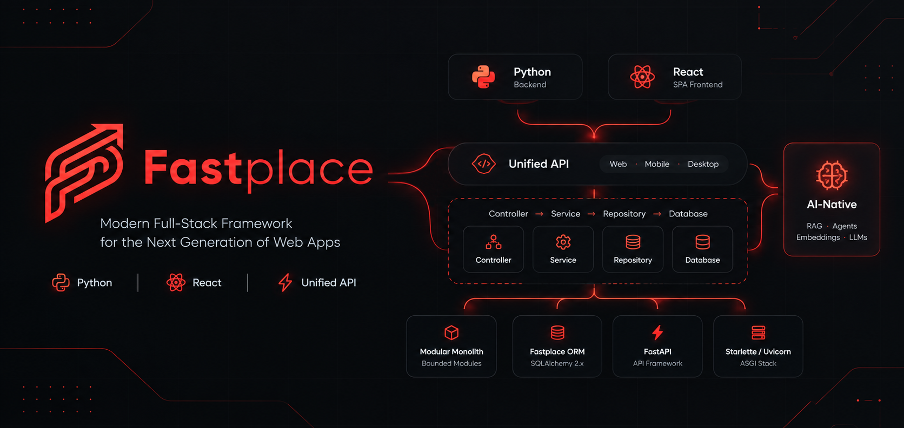

# Fastplace (fastplace.dev)

**An opinionated, full-stack, AI-native web framework built on Python and React — designed around a highly productive developer experience.**

Fastplace is a **modular monolith by default** — one deployable unit composed of strictly bounded internal modules — that serves every client through two presentation edges: a **Server-Driven SPA** (Inertia pattern) for the web and a **Unified API** for mobile and desktop applications, all backed by a single **Controller-Service-Repository (CSR)** core. AI is native infrastructure, not an integration: LLM tool calling, vector search, and SSE streaming are part of the framework fabric.



> **Status:** The framework is implemented (Phases 1–7) and exercised end-to-end by the sample application in this repo. The documentation at [fastplace.dev](https://fastplace.dev) covers the guides; this README is the project overview.

---

## Quickstart

```bash
# 1. Backend + frontend dependencies
python -m venv .venv && source .venv/bin/activate
pip install -e ".[dev]"
npm install

# 2. Environment (never commit .env) — defaults to zero-config SQLite
cp .env.example .env

# 3. Database schema + sample data
fastplace migrate          # Alembic migrations (db.create_all() also works locally)
fastplace db:seed          # projects, tasks, knowledge items

# 4. Full-stack dev — Uvicorn (reload) + Vite (HMR) together
fastplace run dev          # → http://127.0.0.1:8000
```

What you get on first boot:

- `/` — dashboard bridge page (project stats, recent projects) rendered through the Inertia-style React bridge
- `/projects` — the projects module's SPA pages (create projects, add/toggle tasks)
- `/knowledge` — the knowledge module's bridge page (browse recent items, search via `?q=`)
- `/assistant` — the assistant chat page, streaming from the agent over SSE (set `AI_API_KEY` in `.env` for a real provider; the agent's `search_docs` tool queries the knowledge base)
- `/api/v1/*` — the same services as a unified JSON API (`/api/v1/health`, `/api/v1/dashboard`, `/api/v1/projects`, `/api/v1/knowledge/search?q=…`) with Pydantic response contracts on every controller
- `/ai/assistant` — SSE-streamed agent responses (set `AI_API_KEY` in `.env` for a real provider)

Every page is framed by the persistent `AppLayout` (nav chrome survives bridge
navigation), and app-owned middleware lives in `app/http/middleware/`
(`X-Process-Time` request timing) registered from `config/app.py`.

Running the checks:

```bash
pytest                      # backend suite
mypy fastplace && ruff check .   # static analysis
npm run types && npm run test:run  # frontend types + vitest
npx playwright test         # E2E through the real dev server
```

Swap the database by setting `DATABASE_URL` (`postgresql://…` recommended in production — pgvector powers vector search; `mysql://` and MongoDB via `MONGODB_URL` are supported too). See `.env.example` for every switch.

---

## Table of Contents

- [Vision](#vision)
- [Core Architectural Pillars](#core-architectural-pillars)
- [Architectural Decision Record](#architectural-decision-record)
- [System Architecture at a Glance](#system-architecture-at-a-glance)
- [How Fastplace Is Organized](#how-fastplace-is-organized)
  - [Modular Monolith Architecture](#modular-monolith-architecture)
  - [Controller-Service-Repository (CSR) Pattern](#controller-service-repository-csr-pattern)
  - [HTTP Runtime Architecture](#http-runtime-architecture)
  - [Server-Driven SPA & Unified API](#server-driven-spa--unified-api)
  - [Database & ORM Architecture](#database--orm-architecture)
  - [Native AI Infrastructure](#native-ai-infrastructure)
  - [The `fastplace` CLI](#the-fastplace-cli)
- [Project Directory Structure](#project-directory-structure)
- [Stack Selection](#stack-selection)
- [Implementation Roadmap](#implementation-roadmap)
- [Documentation](#documentation)
- [License](#license)

## Vision

Modern full-stack web development often forces a trade-off: developer velocity vs. rich client-side interactivity. Fastplace solves this by pairing Python's asynchronous ecosystem with React's component model, wrapped in a single, cohesive framework. One backend serves two presentation edges — the hydrated React SPA and the Unified API — so web, mobile, and desktop clients share the same services, repositories, and business rules.

## Core Architectural Pillars

1. **Batteries-Included Conventions** — Pre-configured ORM, Auth, Queues, and Routing out of the box. Conventions eliminate boilerplate and make every Fastplace project structurally familiar from day one.
2. **Unified Dev Experience** — A single CLI tool (`fastplace`) manages backend execution, frontend hot reloading (Vite), database migrations, and code generators. One command starts the full stack; one toolchain covers the entire lifecycle.
3. **Modular Monolith by Default** — One deployable unit composed of strictly bounded modules under `app/modules/<name>/{models,repositories,services}`, each owning its domain data and logic. Boundaries are enforced by the framework.
4. **CSR Layering** — Every request flows Controller → Service → Repository → Database. Controllers handle routing, services carry business logic, repositories encapsulate persistence — and the same layers serve both presentation edges.
5. **Seamless Data Bridge and Unified API** — Server-driven UI state passes directly into React components without manual REST/GraphQL boilerplate (Inertia pattern), while a Unified API exposes the same backend logic to mobile and desktop clients. One core, two presentation edges.
6. **Native AI Infrastructure** — First-class abstractions for LLM tool calling, vector databases, RAG pipelines, and server-sent event (SSE) streaming UI components, wired into controllers, models, and the frontend.

## Architectural Decision Record

| ID | Decision | Choice |
| :--- | :--- | :--- |
| ADR-001 | Application architecture | **Modular Monolith** — one deployable unit with strictly bounded internal modules; microservice-grade separation without distributed-systems overhead, with extraction kept cheap and possible later |
| ADR-002 | Layering pattern | **Controller-Service-Repository (CSR)** — controllers stay thin routing layers, services own business logic, repositories own persistence |
| ADR-003 | Client model | **Server-Driven SPA (Inertia pattern) + Unified API** — one CSR backend, two presentation edges, no duplicated backend logic per client |
| ADR-004 | Database & ORM | **SQLAlchemy 2.x + Alembic core, wrapped by the Fastplace ORM public API** — fluent ergonomics on top of SQLAlchemy's depth. SQLite is the zero-config default; PostgreSQL is recommended for production and AI (pgvector); MySQL is supported; MongoDB ships as a separate document adapter. SQLModel is not the core abstraction |
| ADR-005 | Multi-tenancy | **First-party opt-in package (`fastplace-tenancy`)** — the core framework stays tenant-agnostic; company-scoped applications install the package for automatic scoping and defense-in-depth isolation |
| ADR-006 | HTTP/ASGI framework | **FastAPI application core on the Starlette ASGI foundation** — routing, DI, Pydantic v2, OpenAPI, and WebSocket via FastAPI; middleware, primitives, and lifespan via Starlette; Uvicorn executes the stack. Both stay reachable as explicit escape hatches behind `fastplace.http` |

## System Architecture at a Glance

One Python process serving a React SPA bridge, a unified JSON API, a native AI engine, and a capability-aware data layer, all orchestrated by one CLI:

```text
+-----------------------------------------------------------------------+
|                             Fastplace CLI                             |
|         (`fastplace run dev` / `fastplace serve` / Generators)        |
+-----------------------------------------------------------------------+
                                      |
                   +------------------+------------------+
                   |                                     |
       Bridge Protocol                        Unified JSON API
       (X-Fastplace-Request: true)            (session / token auth)
                   |                                     |
                   v                                     v
+---------------------------------+   +---------------------------------+
|            Web Browser          |   |     Mobile / Desktop Apps       |
|  React SPA (@fastplace/react)   |   |  Unified JSON API clients via   |
|  hydrated pages from            |   |  routes/api.py: same services,  |
|  routes/web.py                  |   |  same repositories              |
+---------------------------------+   +---------------------------------+
                   |                                     |
                   +------------------+------------------+
                                      |
                                      v
+-----------------------------------------------------------------------+
|                   Python Backend (modular monolith)                   |
|            one deployable unit, one ASGI stack (N workers)            |
|                                                                       |
|   Fastplace HTTP Layer                   +------------------------+   |
|   FastAPI Application Core               |    AI Agent Engine     |   |
|   (Starlette ASGI Foundation)            | Function-as-Tool Reg.  |   |
|   CSR Pipeline:                          | Structured Outputs     |   |
|  Controllers -> Services -> Repositories | SSE Streaming          |   |
|   Native Auth & RBAC                     | pgvector Vector Stores |   |
|   SAQ Async Task Queue (app/jobs + Redis)+------------------------+   |
|   Fastplace ORM (public API)                                          |
|      over SQLAlchemy 2.x + Alembic                                    |
+-----------------------------------------------------------------------+
       |                  |                  |                  |
       v                  v                  v                  v
+--------------+   +--------------+   +--------------+   +--------------+
|    SQLite    |   |  PostgreSQL  |   |    MySQL     |   |   MongoDB    |
|  (default,   |   | (recommended |   |  (supported  |   |  (separate   |
| zero-config) |   |  + pgvector) |   |  relational) |   |  document    |
|              |   |              |   |              |   |  adapter)    |
+--------------+   +--------------+   +--------------+   +--------------+
```

## How Fastplace Is Organized

### Modular Monolith Architecture

Fastplace decomposes applications by business capability — billing, projects, accounts — but the decomposition is logical, not physical. Modules run in a single process, share a single database, and deploy with a single command (`fastplace serve`). From microservices Fastplace borrows the discipline of boundaries; what it refuses to borrow is the distributed runtime.

- **Module anatomy** — each module owns its `models/`, `repositories/`, and `services/`; controllers live outside modules in `app/http/controllers` as thin routing adapters.
- **One legal cross-module edge** — service → service. Modules never import another module's repositories or models; cross-module calls pass primitives or Pydantic DTOs, never ORM entities.
- **Enforced boundaries** — an import-lint (`fastplace lint:modules`) reads the import graph and fails the build on violations; it runs in `fastplace run dev` and as a hard CI gate.
- **The decisive advantage: the transaction** — a workflow spanning two modules (close a project, issue its invoice) is one atomic block via `async with db.transaction():`, not a saga.
- **The extraction path** — a module with a clean boundary is already shaped like a service; extraction (freeze contract → swap transport → move events → split data → deploy separately) stays cheap and is never the default.

### Controller-Service-Repository (CSR) Pattern

Every request follows the same path: **Client Request → Controller → Service → Repository → Database**.

| Layer | Location | Owns | Must Never |
| :--- | :--- | :--- | :--- |
| **Controller** | `app/http/controllers` | HTTP conversation: parsing, Pydantic v2 request-schema validation, edge-level authorization, calling services, shaping `render(...)` props or JSON | Contain business logic; import models or repositories; build queries; open transactions |
| **Service** | `app/modules/<name>/services` | Business rules, orchestration, transaction boundaries, domain exceptions, the module's public API and typed result contracts | Touch HTTP; construct queries directly; import from the HTTP layer |
| **Repository** | `app/modules/<name>/repositories` | All query construction through the Fastplace ORM — filters, eager loads, ordering, pagination, aggregates | Make business decisions; know HTTP or serialization; own transaction boundaries |

Both presentation edges terminate in controllers that call the same services, so business logic is written exactly once and shared by web, mobile, and desktop clients. Pydantic schemas validate input at the edge and serialize output before any model instance reaches a client — explicit serialization prevents accidental exposure of password hashes, internal identifiers, and audit fields.

### HTTP Runtime Architecture

Fastplace's HTTP runtime is a deliberate layering of two complementary frameworks, not a choice between them (ADR-006):

```text
Fastplace Framework   (HTTP / routing / controllers / requests / responses / middleware / lifecycle)
        |
        v
FastAPI               (application HTTP framework: routing, DI, Pydantic v2, OpenAPI, WebSocket)
        |
        v
Starlette             (ASGI foundation: middleware, request/response, WebSocket primitives, lifespan)
        |
        v
Uvicorn               (ASGI server — development and production)
```

- **Controllers own requests; services own logic.** Business logic never lives inside `@app.get(...)` / `@app.post(...)` route handlers — the Fastplace path is Route → Controller → Service → Repository.
- **Own request/response abstractions.** Application code imports `fastplace.http` (`render`, `request`, `response`, middleware, lifecycle APIs), never `fastapi` or `starlette` directly.
- **Escape hatches stay reachable.** The underlying FastAPI application object (and through it Starlette) remains available for edge cases — mirroring the ORM escape hatch — and such code is deliberately framework-coupled.

### Server-Driven SPA & Unified API

Fastplace replaces the classic "React app plus separate REST API" split with a server-driven SPA, and serves mobile/desktop clients from the very same services.

| Surface | Routes | Response Shape | Primary Consumers |
| :--- | :--- | :--- | :--- |
| Web SPA (bridge) | `routes/web.py` | HTML document with embedded JSON on first load; `component` + `props` JSON on subsequent navigation | React via `@fastplace/react` |
| Unified API | `routes/api.py` | JSON validated by Pydantic v2 response schemas (versioned `/api/v1/...`) | Mobile apps, desktop apps, integrations |
| AI streaming | `routes/ai.py` | Server-Sent Events (SSE) streams | `@fastplace/ai-react` hooks, any SSE client |

- **The bridge protocol (Inertia pattern):** the initial page load returns HTML with an embedded JSON payload; subsequent navigation sends `X-Fastplace-Request: true` and receives only updated props and component names. The frontend router resolves the component under `resources/js/pages/` and mounts it with Python-supplied props via `usePage().props`.
- **One backend, zero drift:** the unified API controller calls the *same* module services as the bridge controller — only the serialization edge differs. The web edge typically uses session auth with CSRF protection; the API edge uses token auth.
- **A fixed boundary:** ORM objects never become responses directly — services return Pydantic-serializable data.

### Database & ORM Architecture

> **Guiding principle:** Fastplace developers program against the **Fastplace ORM API**. **SQLAlchemy 2.x remains the relational engine underneath.** SQLModel is not the core abstraction.

An await-only, fluent public API — `find()`, `where()`, `first()`, `get()`, `all()`, `count()`, `create()`, `save()`, `delete()`, `with_()` (eager loading), `order_by()`, `paginate()`, and soft-delete accessors `with_deleted()` / `only_deleted()` — over SQLAlchemy 2.x async engines, Alembic migrations, and a Database Manager owning connections, pooling, and transaction scopes.

| Database | Role | Async Driver |
| :--- | :--- | :--- |
| **SQLite** | **Default** — zero-config local development, tests, small apps | `aiosqlite` |
| **PostgreSQL** | **Recommended production database** — concurrency, JSONB, advanced indexing, full-text search, `pgvector` AI workloads | `asyncpg` |
| **MySQL** | Supported relational backend (tested against MySQL 8.x) | `asyncmy` |
| **MongoDB** | Separate document-database adapter (document ODM API) — never a fake relational facade | official async-capable MongoDB driver |

Key behaviors:

- **Transactions as a first-class capability** — services open the boundary with `async with db.transaction():`; repositories execute the work inside. All-or-nothing across modules.
- **Model lifecycle events** — `creating → created → updating → updated → deleting → deleted → restored`, feeding the broader event system (domain events → queue / WebSocket / notification / AI).
- **Query scopes & soft deletes** — reusable, chainable query fragments; global soft-delete scope by default; the tenant scope is contributed by the opt-in `fastplace-tenancy` package.
- **Capability registry, no silent emulation** — drivers declare capabilities (`supports_vector`, `supports_json`, `supports_full_text`, `supports_transactions`, `supports_returning`, `supports_rls`); portability follows a strict three-layer policy: portable API first, capability checks before optional features, explicit escape hatches (`User.sa_model`, `User.sa_query()`, `db.raw`) for dialect-specific work.
- **Alembic behind the CLI** — developers never invoke Alembic directly; migrations live in `database/migrations/`, seeders in `database/seeders/`. **Generate migrations on the backend you deploy to**: `VectorField` bakes to `JSON` on SQLite and `VECTOR(dim)` on PostgreSQL, so a revision generated against one backend does not transplant to the other — run `make:migration` with the target `DATABASE_URL` set.
- **Search architecture** — standard filters stay in repositories; search goes through a separate search service. PostgreSQL FTS is the default backend (zero additional dependencies); self-hosted engines (e.g. Meilisearch) are explicit opt-ins; Fastplace never adds a third-party or paid search service as a default.
- **Contract-tested portability** — an automated compatibility matrix runs every portable public-API behavior against SQLite, PostgreSQL, and MySQL; MongoDB carries its own document-adapter contract suite. CI (`.github/workflows/ci.yml`) runs the whole matrix on every push: service containers provide PostgreSQL (pgvector), MySQL, and MongoDB; module boundaries gate the build before any test executes.

**Multi-tenancy is not a framework default.** It ships as the first-party, opt-in `fastplace-tenancy` package: company-scoped models extend `CompanyScopedModel`, every query is automatically filtered by `company_id`, and isolation is enforced defense-in-depth across ORM scope, middleware, authorization, Row-Level Security (PostgreSQL), cache key prefixes, job metadata, storage, search, and vector-store filters.

### Native AI Infrastructure

AI runs inside the same process, wired into the CSR layers — not bolted on as an integration:

- **Auto-registered agent tools** — `@Tool` (`fastplace.ai.Tool`) converts standard Python functions into structured JSON schemas for LLM function calling, derived from type hints and docstrings. Tools obey the same rule as controllers and jobs: module services only, never repositories or models.
- **Provider-agnostic model access** — OpenAI and Anthropic routed through **LiteLLM**; structured outputs validated through **Instructor** and Pydantic.
- **Vector-native models** — `VectorField` column types make any ORM model similarity-searchable via `Model.vector_search()`; PostgreSQL + pgvector is the recommended production path, with alternate vector backends reachable behind the same capability-aware API.
- **Streaming UI hooks** — `useAIStream` and `useAgent` from `@fastplace/ai-react` consume SSE streams from `routes/ai.py`; agent endpoints assemble an `Agent(model=..., system_prompt=..., tools=[...])` and return `agent.stream_response(...)`. Because `/ai/*` streams are plain HTTP and SSE, mobile and desktop clients consume the same endpoints directly.

### The `fastplace` CLI

The CLI (Typer + Rich) is the main developer interface — it orchestrates server runtimes, code generation, and database state:

| Category | Command | Action |
| :--- | :--- | :--- |
| **Server** | `fastplace run dev` | Concurrently starts ASGI backend (Uvicorn with reload) & Vite dev server (HMR) |
| | `fastplace serve` | Compiles frontend assets and launches the optimized multi-worker production ASGI server |
| **Maintenance** | `fastplace down` / `up` | Toggle maintenance mode — every request gets a 503, then bring the application back |
| **Scaffolding** | `fastplace new <Name>` | Creates a new application skeleton — module-first layout, `.env.example`, SQLite default |
| | `fastplace make:module <Name>` | Scaffolds a bounded module — `app/modules/<name>/{models,repositories,services}` |
| | `fastplace make:controller <Name>` | Controller stub in `app/http/controllers/` |
| | `fastplace make:model <Name> -m` | Fastplace ORM model + Alembic migration in one step |
| | `fastplace make:service <Name>` / `make:repository <Name>` | Service / repository stubs inside a module |
| | `fastplace make:agent <Name>` | AI agent and tool suite stub in `app/ai/` |
| | `fastplace make:page <Name>` | Hydrated React page component in `resources/js/pages/` |
| | `fastplace make:command` / `make:component` / `make:layout` / `make:hook` / `make:vector-store` | CLI command module, React component/layout/hook stubs, vector-store registration |
| | `fastplace make:seeder, make:job, make:request, make:middleware, make:policy, make:test, make:scope, make:config, make:mail, …` | Stubs for the remaining scaffoldable surfaces, including support classes (`make:class`, `make:enum`, `make:exception`, `make:interface`) |
| **Inspection** | `fastplace list` / `env` | Every registered command grouped by namespace; current framework environment |
| | `fastplace route:list` / `config:show` / `model:list` / `model:show` / `event:list` / `module:list` / `gate:list` | Routes, effective config, ORM models, event listeners, modules, and gate abilities at a glance |
| | `fastplace ai:tools` / `ai:vectors` / `search:status` | Registered agent tools, vector stores, and the active search backend |
| **Database** | `fastplace db:configure <driver>` | Writes the `DATABASE_*` env block — `sqlite`, `postgresql`, `mysql`, or `mongodb` |
| | `fastplace migrate` / `migrate:rollback` / `migrate:status` | Run, revert, and inspect Alembic migrations (`migrate --pretend` previews the SQL) |
| | `fastplace db:seed` / `db:reset` | Seed via `database/seeders/`; drop, re-migrate, re-seed |
| | `fastplace migrate:reset` / `db:wipe` | Revert every migration, or drop every table and view — no rebuild, no seed |
| | `fastplace db:show` / `db:table` / `db:cli` / `db:documents` | Live database overview, one table's schema, the native SQL shell, document-adapter status |
| **Queue** | `fastplace queue:work` / `queue:restart` / `queue:monitor` | Process jobs from `app/jobs/`, recycle workers at the next job boundary, watch queue depths |
| | `fastplace queue:failed` / `queue:retry` / `queue:flush` / `queue:forget` / `queue:prune-failed` / `queue:clear` | Failed-job forensics — list, re-dispatch, delete, and prune records; clear pending jobs |
| **Scheduling** | `fastplace schedule:list` / `schedule:run` / `schedule:work` / `schedule:test` | List tasks with next due time, run what's due now, work every minute in the foreground, or fire one task immediately |
| **Operations** | `fastplace cache:clear` / `cache:forget` / `key:generate` / `log:tail` | Cache upkeep, `APP_KEY` generation, live log tailing |
| | `fastplace env:encrypt` / `env:decrypt` / `session:gc` / `throttle:clear` | Encrypt/restore `.env`, sweep expired sessions, un-block throttled clients |
| | `fastplace token:create` / `token:revoke` / `user:create` / `mail:test` | Personal access tokens, account creation, mail transport probe |
| **Code Quality** | `fastplace lint:modules` | Enforce module boundaries — fails the build on illegal imports |
| **Shell** | `fastplace shell` | Interactive shell loaded with models and framework context |

A new project boots on SQLite with no external database installation: `fastplace new myapp` → `fastplace migrate` → `fastplace run dev`.

## Project Directory Structure

Fastplace applications are organized **module-first**: business logic lives inside bounded modules under `app/modules/`, while the HTTP edge, frontend assets, database state, and configuration follow fixed framework conventions:

```text
my-fastplace-app/
├── app/                              # Python application logic
│   ├── http/                         # HTTP edge — the routing layer
│   │   ├── controllers/              # Thin controllers: validate, delegate, respond
│   │   ├── requests/                 # Pydantic v2 request schemas (HTTP-edge validation)
│   │   └── middleware/               # Auth & CSRF middleware (company-context middleware from fastplace-tenancy)
│   ├── modules/                      # Bounded business modules (module-first)
│   │   ├── billing/
│   │   │   ├── models/               # Invoice, InvoiceLine, TimeEntry (Fastplace ORM)
│   │   │   ├── repositories/         # Data access — the only path to the database
│   │   │   └── services/             # Billing business logic; public module surface
│   │   └── projects/
│   │       ├── models/               # Project, Task entities
│   │       ├── repositories/
│   │       └── services/
│   ├── ai/                           # AI agents, tools, and vector store registries
│   │   ├── agents/
│   │   ├── tools/
│   │   └── vectors/
│   ├── jobs/                         # Async queue background jobs (SAQ + Redis)
│   └── models/                       # Shared base model classes ONLY — no entities
├── database/
│   ├── migrations/                   # Alembic database migrations
│   └── seeders/                      # Seeders run by `fastplace db:seed`
├── resources/
│   ├── js/                           # React app source
│   │   ├── components/               # Shared UI components
│   │   ├── hooks/                    # Fastplace React hooks
│   │   ├── layouts/                  # Page layout wrappers
│   │   └── pages/                    # React views (mapped to backend routes)
│   └── css/                          # Global styles & Tailwind configuration
├── routes/                           # Thin route declarations — no business logic
│   ├── api.py                        # Unified JSON API — mobile & desktop clients
│   ├── web.py                        # Server-driven SPA bridge pages (Inertia pattern)
│   └── ai.py                         # Streamed AI & agent endpoints (SSE)
├── config/                           # Configuration loaded from .env
│   ├── app.py
│   ├── database.py                   # SQLite default; PostgreSQL recommended (pgvector)
│   ├── ai.py
│   └── auth.py
├── public/                           # Static public assets & build output (public/build/)
├── storage/                          # Logs, cache, local uploads — runtime output, gitignored
├── .env.example                      # Environment template — never commit .env
├── pyproject.toml                    # Python dependencies & CLI configuration
├── package.json                      # Frontend dependencies (React, Vite, Tailwind)
└── vite.config.js                    # Vite bundler middleware
```

Every `fastplace make:*` generator writes into this canonical layout, so a Fastplace codebase is predictable from the first commit. The shared kernel (`app/models/`) holds only base classes and mixins — never entities — preventing the gradual accumulation of a "god folder" of models.

## Stack Selection

| Concern | Technology |
| :--- | :--- |
| Backend engine | Python 3.12+ (async-first) |
| HTTP application framework | FastAPI — application core: routing, dependency injection, OpenAPI generation, WebSocket support |
| ASGI foundation | Starlette — middleware, request/response primitives, lifespan, low-level ASGI |
| ASGI server | Uvicorn — development and production runtime |
| CLI | Typer + Rich |
| Validation / serialization | Pydantic v2 |
| Database & ORM | Fastplace ORM (public API) over SQLAlchemy 2.x + Alembic |
| Relational drivers | `aiosqlite` (SQLite), `asyncpg` (PostgreSQL), `asyncmy` (MySQL) |
| Document database | MongoDB via a separate async document adapter (ODM API) |
| Frontend runtime | React 18+, Tailwind CSS, Vite, bridged by `@fastplace/react` (`usePage`, page resolver) |
| Cache & task queue | Redis — SAQ (Simple Async Queue) workers and the framework cache layer |
| Search | PostgreSQL FTS behind a separate search service; self-hosted engines are explicit opt-ins |
| Multi-tenancy | First-party `fastplace-tenancy` package — opt-in; the core stays tenant-agnostic |
| AI orchestration | OpenAI / Anthropic APIs, LiteLLM, Instructor, `@fastplace/ai-react` |

One deployable modular monolith, one CSR backend, one ORM public API: each concern — server runtime, data access, presentation, background work, AI — is owned by a single well-bounded technology behind a Fastplace-controlled developer experience.

## Implementation Roadmap

The ORM is sequenced immediately after the core engine because every layer above it — the React bridge, the unified API, modules, and AI — consumes the Fastplace ORM public API. Presentation edges come after the data layer so both `routes/web.py` and `routes/api.py` stabilize against one contract.

| Phase | Timeline | Scope |
| :--- | :--- | :--- |
| **1. Core Foundation & CLI** | Weeks 1–4 | FastAPI runtime on the Starlette ASGI foundation; Pydantic v2; Uvicorn dev/production runtime; Fastplace HTTP abstraction, request/response, middleware, lifespan, routing, WebSocket; CLI runner; project bootstrap (`config/*.py`, `.env`, `routes/`) |
| **2. Fastplace ORM Foundation** | Weeks 5–9 | SQLAlchemy 2.x async engine, DatabaseManager; capability registry; Model public API; query builder (filtering, ordering, eager loading, pagination); relationships; transactions & soft deletes; model events & scopes; Alembic integration + `db:configure` & seeders |
| **3. React Bridge & Unified API** | Weeks 10–13 | HTML/JSON dual renderer (`render()`); `@fastplace/react` (`usePage`, dynamic page resolver); Vite plugin for unified hot reloading; `make:page`; unified JSON API layer (`routes/api.py`, Pydantic schemas, OpenAPI) |
| **4. Auth, Modules & CSR Tooling** | Weeks 14–17 | JWT/session auth + CSRF; first-party `fastplace-tenancy` package (opt-in); module system with enforced import boundaries; CSR generators (`make:module`, `make:service`, `make:repository`, `make:controller`); SAQ + Redis background queues |
| **5. AI Engine** | Weeks 18–21 | `@Tool` decorator + Agent abstraction; pgvector integration (`VectorField`, `Model.vector_search()`); SSE streaming behind `routes/ai.py`; `make:agent`; `@fastplace/ai-react` (`useAIStream`, `useAgent`) |
| **6. Database Breadth** | Weeks 22–25 | MySQL hardening (`asyncmy`); MongoDB document adapter; compatibility test matrix across relational backends + MongoDB contract suite; search service abstraction; read-replica groundwork |
| **7. Production Polish** | Weeks 26–28 | Query instrumentation + slow-query detection; developer error overlays + N+1 warnings; publish documentation at fastplace.dev and launch sample applications |

Phase ordering is deliberate: the ORM precedes both presentation edges and the module system, so the modular monolith and the unified API are never built on a shifting data layer; database breadth lands after the portable API is proven against SQLite and PostgreSQL. The module-first directory layout exists from project bootstrap, so later phases add enforcement and generators on top of an already-correct structure.

## Documentation

- **[fastplace.dev](https://fastplace.dev)** — guides for getting started, the database layer, authentication, AI, background jobs, testing, deployment, and versioning.

## Acknowledgements

Fastplace's developer-experience goals are informed by many excellent frameworks — most notably [Laravel](https://laravel.com) (MIT) for its ergonomics-first API design, and [Inertia.js](https://inertiajs.com) (MIT) for the server-driven SPA pattern the React bridge follows. Fastplace is an independent Python + React implementation with no shared code.

## License

Fastplace is open-sourced under the [MIT License](LICENSE).
